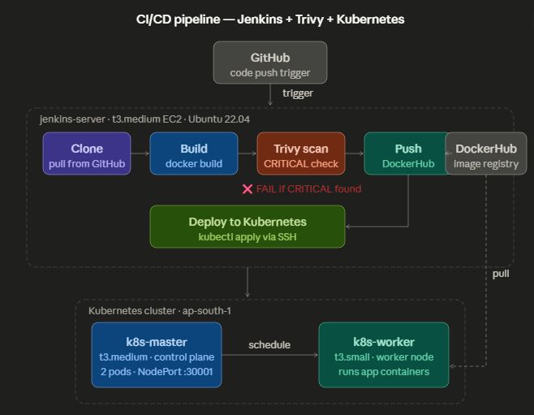
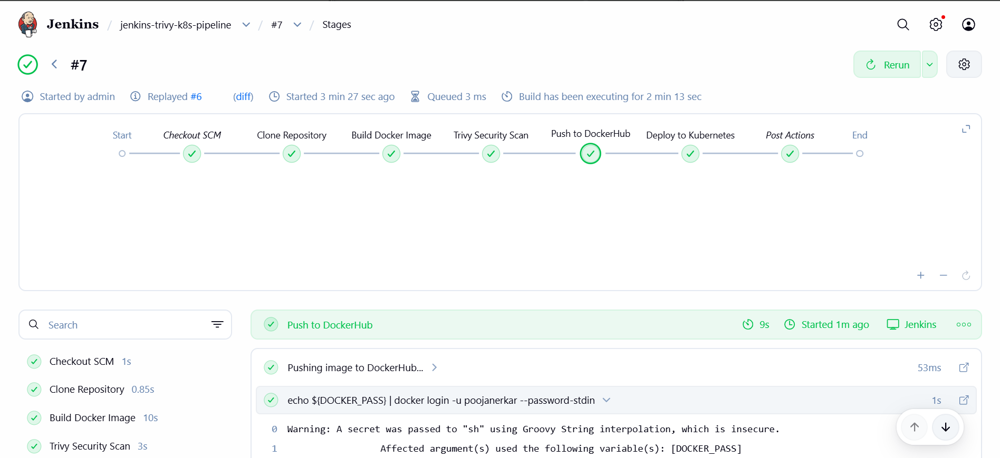
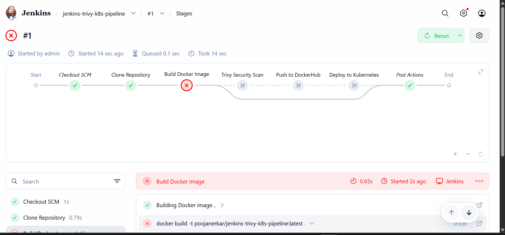
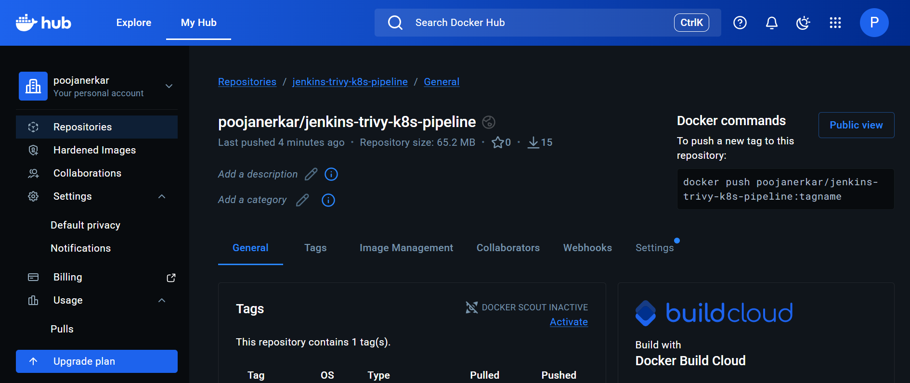
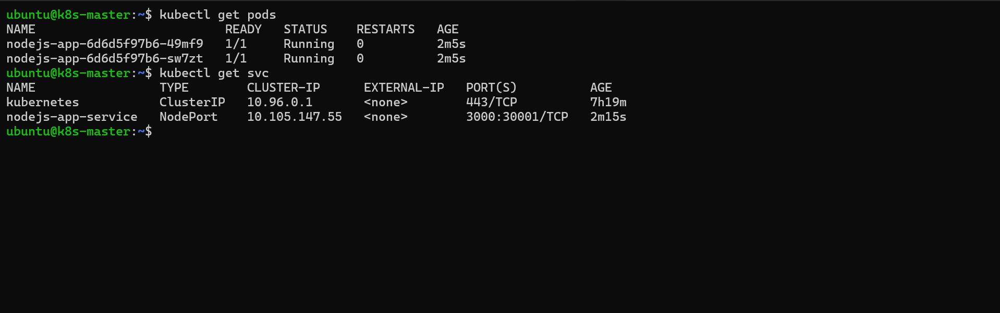
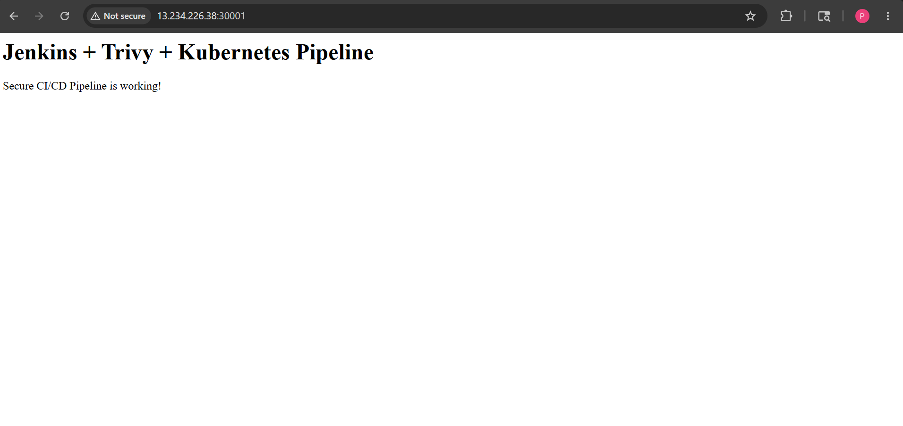

# Secure CI/CD Pipeline using Jenkins, Trivy & Kubernetes

This project demonstrates a secure CI/CD pipeline where Docker images are automatically scanned for vulnerabilities before deployment to Kubernetes.

I built this project to understand how DevOps and security practices work together in real-world deployment workflows.

---

# Project Objective

The goal of this project is to prevent vulnerable Docker images from reaching production environments.

The pipeline automatically:

- Pulls code from GitHub
- Builds a Docker image
- Scans the image using Trivy
- Fails the pipeline if CRITICAL vulnerabilities are found
- Pushes only secure images to DockerHub
- Deploys the application to Kubernetes

---

# Architecture Diagram



---

# Technologies Used

- Jenkins
- Docker
- Kubernetes
- Trivy
- GitHub
- DockerHub
- Node.js
- AWS EC2

---

# Project Workflow

```text
GitHub Push
     │
     ▼
Jenkins Pipeline
     │
     ├── Clone Repository
     ├── Build Docker Image
     ├── Trivy Security Scan
     │       │
     │       ├── CRITICAL Found → Pipeline Fails ❌
     │       └── No Issues Found → Continue ✅
     │
     ├── Push Image to DockerHub
     └── Deploy to Kubernetes
```

---

# Infrastructure Setup

| Server | Purpose |
|---|---|
| Jenkins Server | Jenkins + Docker + Trivy |
| Kubernetes Master | Kubernetes Control Plane |
| Kubernetes Worker | Runs Application Containers |

### AWS Region
- ap-south-1 (Mumbai)

---

# Project Structure

```bash
jenkins-trivy-k8s-pipeline/
│
├── app.js
├── Dockerfile
├── Jenkinsfile
│
├── k8s/
│   ├── deployment.yaml
│   └── service.yaml
│
└── screenshots/
    ├── architecture.png
    ├── pipeline-pass.png
    ├── pipeline-fail.png
    ├── dockerhub.png
    ├── kubectl-output.png
    └── app-output.png
```

---

# Dockerfile

```dockerfile
FROM node:22-alpine3.21

RUN apk update && apk upgrade --no-cache

WORKDIR /app

COPY app.js .

EXPOSE 3000

CMD ["node", "app.js"]
```

I used `apk upgrade` to update Alpine packages and reduce vulnerabilities before the Trivy scan.

---

# Jenkins Pipeline

The Jenkins pipeline performs these steps:

1. Pull code from GitHub
2. Build Docker image
3. Scan image using Trivy
4. Push secure image to DockerHub
5. Deploy application to Kubernetes

---

# Security Gating Logic

The most important part of this project is the security scan stage.

Trivy scans the Docker image for vulnerabilities before deployment.

If CRITICAL vulnerabilities are detected:
- Jenkins automatically fails the pipeline
- Docker image is not pushed
- Kubernetes deployment does not happen

---

# Trivy Scan Command

```bash
trivy image --exit-code 1 --severity CRITICAL image-name
```

### Important Flags

| Flag | Purpose |
|---|---|
| `--severity CRITICAL` | Checks only critical vulnerabilities |
| `--exit-code 1` | Fails Jenkins pipeline if vulnerabilities are found |

---

# Important Jenkinsfile Snippet

```groovy
stage('Trivy Security Scan') {
    steps {
        sh """
        trivy image --exit-code 1 \
        --severity CRITICAL \
        --no-progress \
        ${DOCKER_IMAGE}:${DOCKER_TAG}
        """
    }
}
```

---

# Kubernetes Deployment

### deployment.yaml

```yaml
replicas: 2

containers:
- name: nodejs-app
  image: poojanerkar/jenkins-trivy-k8s-pipeline:latest
```

### service.yaml

```yaml
type: NodePort
nodePort: 30001
```

Complete Kubernetes YAML files are available inside the `k8s/` directory.

---

# Security Validation

To test the security gate, I intentionally used a vulnerable Docker base image.

### Vulnerable Image

```dockerfile
FROM node:18-alpine
```

### Trivy Scan Result

```text
Total: 19 Vulnerabilities
HIGH: 15
CRITICAL: 4
```

Result:
- Pipeline failed successfully ✅
- Deployment was blocked ✅

---

# Secure Deployment

After upgrading the base image:

```dockerfile
FROM node:22-alpine3.21
```

and updating packages using:

```dockerfile
RUN apk update && apk upgrade --no-cache
```

the Trivy scan passed successfully and the application was deployed to Kubernetes.

---

# Deployment Verification

```bash
kubectl get pods
kubectl get svc
```

Expected Output:

```text
NAME                         READY   STATUS
nodejs-app-xxxxx             1/1     Running
nodejs-app-yyyyy             1/1     Running
```

---

# Application Access

The application is accessible using Kubernetes NodePort service:

```text
http://<worker-node-ip>:30001
```

---

# Screenshots

## Jenkins Pipeline Success



---

## Jenkins Pipeline Failure



---

## DockerHub Repository



---

## Kubernetes Pods Running



---

## Application Running



---

# What I Learned

Through this project, I learned:

- How Jenkins CI/CD pipelines work
- Docker image creation and optimization
- Kubernetes deployment basics
- Vulnerability scanning using Trivy
- Security-first DevOps practices
- Automated deployment workflows

---

# Future Improvements

- Add SonarQube for code quality scanning
- Integrate GitHub Webhooks
- Add Slack/Email notifications
- Use Helm charts for Kubernetes deployment
- Implement rolling updates and rollback strategies

---

# Conclusion

This project helped me understand how security can be integrated into a CI/CD pipeline using DevSecOps practices.

Using Trivy as a security gate ensures that vulnerable Docker images are blocked before deployment. Only secure images are pushed and deployed to Kubernetes automatically.